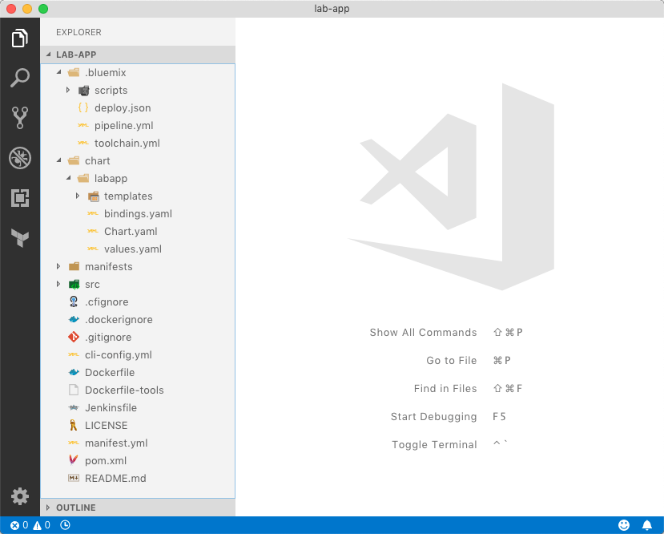

# Create a starter application

The IBM Cloud developer tools `ibmcloud dev` greatly cut down on development time by generating application starters with all the necessary boilerplate, build and configuration code so that you can start coding business logic faster.

1. Start the `ibmcloud dev` wizard.
   ```sh
   ibmcloud dev create
   ```
1. To create a Node or Java starter, select:
   
- Backend Service / Web App
- Node
- Node.js Web App with Express.js (Web App)
   
- Backend Service / Web App
- Java - MicroProfile / JavaEE
- Java Web App with Eclipse MicroProfile and Java EE (Web App)
   

   
   The developer tools also provide several starter combinations in different programming languages.
   
1. Enter a **name** for your application.
   
   Use your initials as prefix and only letters (a to z) when naming the app (no hyphen, no underscore, etc.).
   
1. Select the resource group you were assigned to to deploy this application.
1. Do not add additional services.
1. Do not add a DevOps toolchain, select **manual deployment**.

This generates a starter application complete with the code and all the necessary configuration files for local development and deployment to cloud on Cloud Foundry or Kubernetes.


