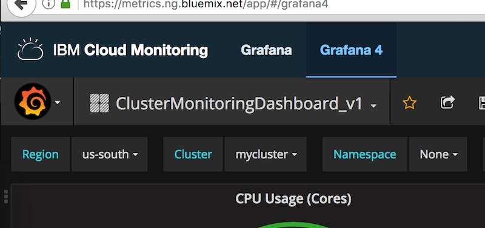
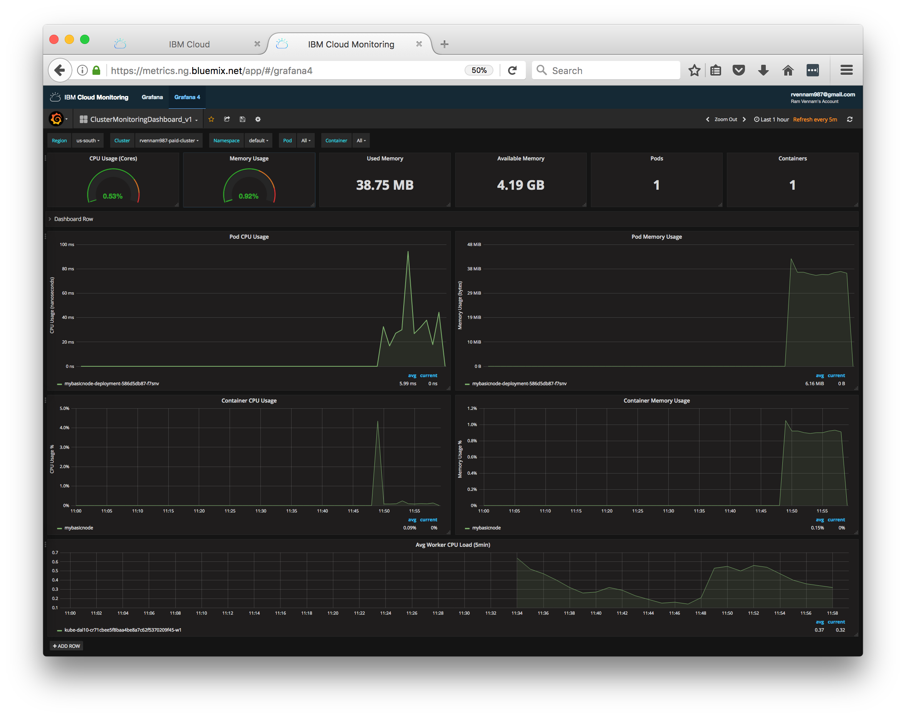
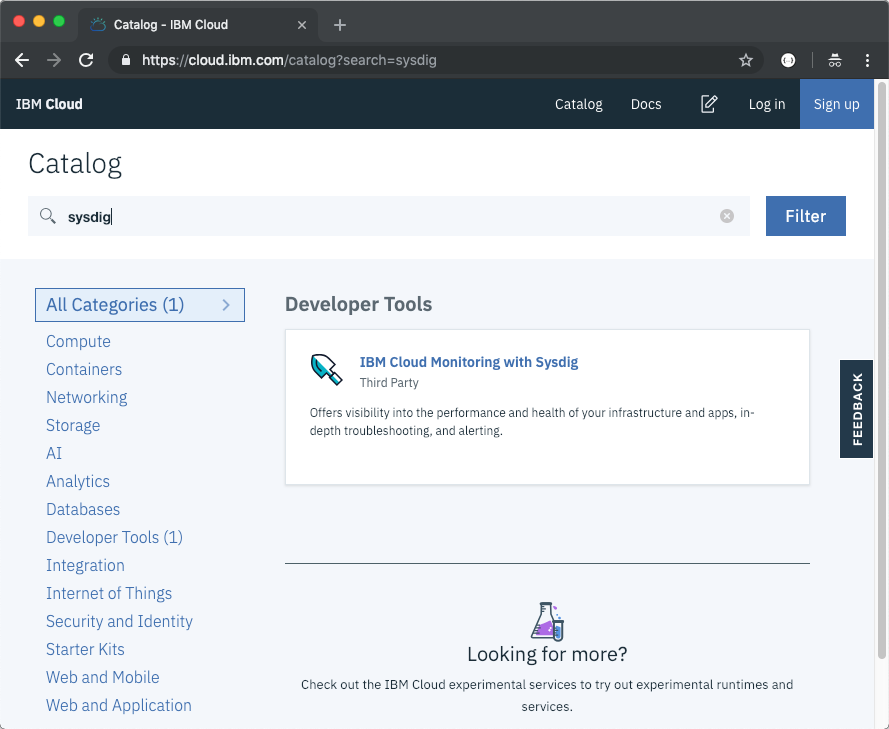
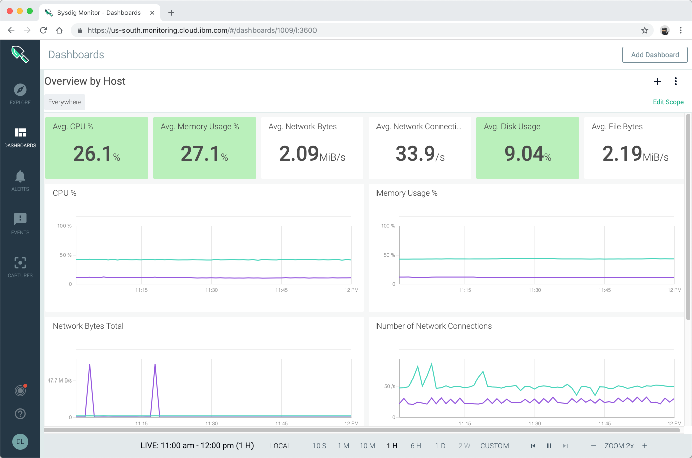

# Monitoring

<!-- ## Using Grafana

Metrics for standard clusters are located in the IBM Cloud account that was logged in to when the Kubernetes cluster was created. If you specified an IBM Cloud space when you created the cluster, then metrics are located in that space. Container metrics are collected automatically for all containers that are deployed in a cluster. These metrics are sent and are made available through Grafana.

1. To view **metrics**, navigate to [clusters](https://cloud.ibm.com/containers-kubernetes/clusters) and select the appropriate **location** to see your cluster.
2. Next to **Metrics**, click **View**. This should launch Grafana in a new tab.
3. In the top right corner, click on your username and choose **Domain**: **account** and select your **Account**.
4. Click on **Home** and select the **ClusterMonitoringDashboard_V5** dashboard that has been pre-defined.
5. Select the region value where your cluster was created next to **Region** and select your cluster name next to **Cluster**.
   
6. In a different window, visit your application URL and refresh the page several times to generate some load.
7. Refresh your Grafana dashboard to see the updated metrics.
    -->

## Using IBM Cloud Monitoring with Sysdig

Sysdig monitor is a third-party cloud-native container-intelligence management system. You can use this to gain operational visibility for your applications, services, and platform. Sysdig offers administrators, DevOps teams and developers advanced features to monitor and troubleshoot, define alerts, and design custom views.

## Configure your cluster with Sysdig

1. Switch to your personal IBM Cloud account.
1. Create an instance of [IBM Cloud Monitoring with Sysdig](https://cloud.ibm.com/observe/monitoring/create) from the catalog:
   1. Set the **Service name** to **YOUR_IBM_ID-sysdig**.
   1. Select the location where your cluster is created. If the location is not in the list, pick Dallas (us-south).
   1. Use the default resource group.
   1. Click **Create**.
1. In the [**Observability** category, under Monitoring](https://cloud.ibm.com/observe/monitoring), locate the service instance you created.
1. Click **Edit sources**:
   1. Select **Kubernetes** as a source
   1. Run the listed commands against your Kubernetes cluster to install the Sysdig Agent.

## View metrics with Sysdig

1. Click **View Sysdig** to open the Sysdig console
1. In the Sysdig _Welcome_ wizard
   1. Select **Kubernetes** as the installation method.
   1. It should show one or more agents already connected.
   1. Select **GO TO NEXT STEP**.
   1. And finally **LET'S GET STARTED**
1. Navigate the Sysdig console to get metrics on your Kubernetes cluster, nodes, deployments, pods, containers.
   1. Under **Explore**, select **Containerized Apps** to view raw metrics for all workloads running on the cluster.
   1. Under **Dashboard**, select **My Shared Dashboards / HTTP Overview** to get a global view of the cluster HTTP load.
   1. Under **Dashboard**, select **My Shared Dashboards / Overview by Host** to understand how nodes are currently performing.

   
   If Kubernetes-specific views do not show data, wait till your cluster starts sending metrics to Sysdig and refresh the Sysdig monitor console.
   


Find more about IBM Cloud Monitoring with Sysdig in the [IBM Cloud documentation](https://cloud.ibm.com/docs/services/Monitoring-with-Sysdig/index.html#getting-started).

